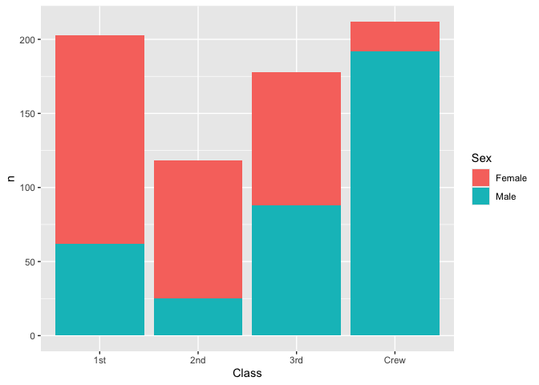
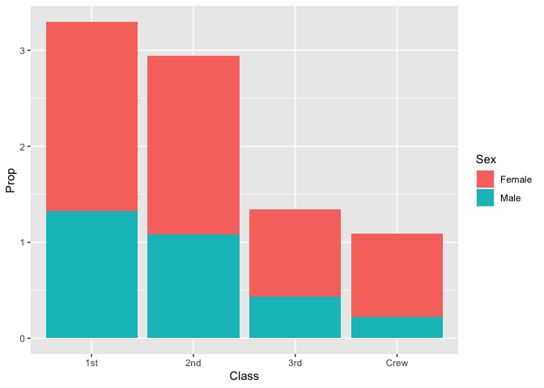
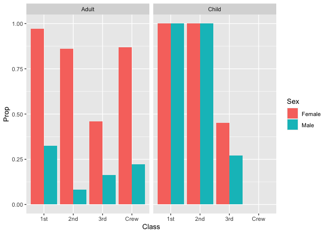

RMS Titanic
================
Hong Yi Zhang
2026-09-09

- [Grading Rubric](#grading-rubric)
  - [Individual](#individual)
  - [Submission](#submission)
- [First Look](#first-look)
  - [**q1** Perform a glimpse of `df_titanic`. What variables are in
    this
    dataset?](#q1-perform-a-glimpse-of-df_titanic-what-variables-are-in-this-dataset)
  - [**q2** Skim the Wikipedia article on the RMS Titanic, and look for
    a total count of souls aboard. Compare against the total computed
    below. Are there any differences? Are those differences large or
    small? What might account for those
    differences?](#q2-skim-the-wikipedia-article-on-the-rms-titanic-and-look-for-a-total-count-of-souls-aboard-compare-against-the-total-computed-below-are-there-any-differences-are-those-differences-large-or-small-what-might-account-for-those-differences)
  - [**q3** Create a plot showing the count of persons who *did*
    survive, along with aesthetics for `Class` and `Sex`. Document your
    observations
    below.](#q3-create-a-plot-showing-the-count-of-persons-who-did-survive-along-with-aesthetics-for-class-and-sex-document-your-observations-below)
- [Deeper Look](#deeper-look)
  - [**q4** Replicate your visual from q3, but display `Prop` in place
    of `n`. Document your observations, and note any new/different
    observations you make in comparison with q3. Is there anything
    *fishy* in your
    plot?](#q4-replicate-your-visual-from-q3-but-display-prop-in-place-of-n-document-your-observations-and-note-any-newdifferent-observations-you-make-in-comparison-with-q3-is-there-anything-fishy-in-your-plot)
  - [**q5** Create a plot showing the group-proportion of occupants who
    *did* survive, along with aesthetics for `Class`, `Sex`, *and*
    `Age`. Document your observations
    below.](#q5-create-a-plot-showing-the-group-proportion-of-occupants-who-did-survive-along-with-aesthetics-for-class-sex-and-age-document-your-observations-below)
- [Notes](#notes)

*Purpose*: Most datasets have at least a few variables. Part of our task
in analyzing a dataset is to understand trends as they vary across these
different variables. Unless we’re careful and thorough, we can easily
miss these patterns. In this challenge you’ll analyze a dataset with a
small number of categorical variables and try to find differences among
the groups.

*Reading*: (Optional) [Wikipedia
article](https://en.wikipedia.org/wiki/RMS_Titanic) on the RMS Titanic.

<!-- include-rubric -->

# Grading Rubric

<!-- -------------------------------------------------- -->

Unlike exercises, **challenges will be graded**. The following rubrics
define how you will be graded, both on an individual and team basis.

## Individual

<!-- ------------------------- -->

| Category | Needs Improvement | Satisfactory |
|----|----|----|
| Effort | Some task **q**’s left unattempted | All task **q**’s attempted |
| Observed | Did not document observations, or observations incorrect | Documented correct observations based on analysis |
| Supported | Some observations not clearly supported by analysis | All observations clearly supported by analysis (table, graph, etc.) |
| Assessed | Observations include claims not supported by the data, or reflect a level of certainty not warranted by the data | Observations are appropriately qualified by the quality & relevance of the data and (in)conclusiveness of the support |
| Specified | Uses the phrase “more data are necessary” without clarification | Any statement that “more data are necessary” specifies which *specific* data are needed to answer what *specific* question |
| Code Styled | Violations of the [style guide](https://style.tidyverse.org/) hinder readability | Code sufficiently close to the [style guide](https://style.tidyverse.org/) |

## Submission

<!-- ------------------------- -->

Make sure to commit both the challenge report (`report.md` file) and
supporting files (`report_files/` folder) when you are done! Then submit
a link to Canvas. **Your Challenge submission is not complete without
all files uploaded to GitHub.**

``` r
library(tidyverse)
```

    ## ── Attaching core tidyverse packages ──────────────────────── tidyverse 2.0.0 ──
    ## ✔ dplyr     1.2.1     ✔ readr     2.2.0
    ## ✔ forcats   1.0.1     ✔ stringr   1.6.0
    ## ✔ ggplot2   4.0.3     ✔ tibble    3.3.1
    ## ✔ lubridate 1.9.5     ✔ tidyr     1.3.2
    ## ✔ purrr     1.2.2     
    ## ── Conflicts ────────────────────────────────────────── tidyverse_conflicts() ──
    ## ✖ dplyr::filter() masks stats::filter()
    ## ✖ dplyr::lag()    masks stats::lag()
    ## ℹ Use the conflicted package (<http://conflicted.r-lib.org/>) to force all conflicts to become errors

``` r
df_titanic <- as_tibble(Titanic)
```

*Background*: The RMS Titanic sank on its maiden voyage in 1912; about
67% of its passengers died.

# First Look

<!-- -------------------------------------------------- -->

### **q1** Perform a glimpse of `df_titanic`. What variables are in this dataset?

``` r
df_titanic %>% 
  glimpse()
```

    ## Rows: 32
    ## Columns: 5
    ## $ Class    <chr> "1st", "2nd", "3rd", "Crew", "1st", "2nd", "3rd", "Crew", "1s…
    ## $ Sex      <chr> "Male", "Male", "Male", "Male", "Female", "Female", "Female",…
    ## $ Age      <chr> "Child", "Child", "Child", "Child", "Child", "Child", "Child"…
    ## $ Survived <chr> "No", "No", "No", "No", "No", "No", "No", "No", "No", "No", "…
    ## $ n        <dbl> 0, 0, 35, 0, 0, 0, 17, 0, 118, 154, 387, 670, 4, 13, 89, 3, 5…

**Observations**:

- Class (1st, 2nd, 3rd, Crew)

- Sex (Male, Female)

- Age (Child, Adult)

- Survived (No, Yes)

- n (The count of people in that specific group)

### **q2** Skim the [Wikipedia article](https://en.wikipedia.org/wiki/RMS_Titanic) on the RMS Titanic, and look for a total count of souls aboard. Compare against the total computed below. Are there any differences? Are those differences large or small? What might account for those differences?

``` r
## NOTE: No need to edit! We'll cover how to
## do this calculation in a later exercise.
df_titanic %>% summarize(total = sum(n))
```

    ## # A tibble: 1 × 1
    ##   total
    ##   <dbl>
    ## 1  2201

**Observations**:

- Are there any differences?
  - Yes. The df_titanic data counts 2201 total people. Wikipedia states
    there were 2,208 people on board. That is a difference of 7 people.
- If yes, what might account for those differences?
  - Historical records from 1912 were messy. Some possible explanations
    were that people traveled under false names, canceled at the last
    minute but were left on the manifest, or were undocumented
    stowaways/crew members.
  - The difference is small overall. 7 people out of 2,201 is about
    0.3%, which is not enough to change the ship-wide survival rate.
  - Revisiting this after q5: whether those 7 matter depends on which
    groups they fall into and this summary alone does not tell us. Group
    sizes are very uneven, from 862 adult crewmen down to a single first
    class girl. One more crewman barely moves that group’s survival rate
    but one more first class girl who died would take that group’s
    survival rate from 100% to 50%. The missing 7 are harmless for the
    big comparisons but could matter for smaller groups.
  - Different figures come from the British and American inquiries and
    later historians revised them so no single “correct” count exists.
    The Wikipedia article itself says estimates vary, so 2,208 isn’t a
    confirmed number either.

### **q3** Create a plot showing the count of persons who *did* survive, along with aesthetics for `Class` and `Sex`. Document your observations below.

*Note*: There are many ways to do this.

``` r
## TASK: Visualize counts against `Class` and `Sex`
df_titanic %>%
  filter(Survived == "Yes") %>%
  ggplot(aes(x = Class, y = n, fill = Sex)) +
  geom_col()
```

<!-- -->

**Observations**:

- Crew males were the largest single group of survivors by count, at
  roughly 190. Their segment alone is taller than the entire 2nd class
  bar and slightly taller than the 3rd class bar.

- In 1st and 2nd class, female survivors clearly outnumbered male
  survivors. In 3rd class the two are close to even, and among crew the
  pattern reverses sharply, with males making up the large majority.

- These are raw counts, so they confound survival with group size. A
  tall bar does not by itself mean a high survival rate.

# Deeper Look

<!-- -------------------------------------------------- -->

Raw counts give us a sense of totals, but they are not as useful for
understanding differences between groups. This is because the
differences we see in counts could be due to either the relative size of
the group OR differences in outcomes for those groups. To make
comparisons between groups, we should also consider *proportions*.\[1\]

The following code computes proportions within each `Class, Sex, Age`
group.

``` r
## NOTE: No need to edit! We'll cover how to
## do this calculation in a later exercise.
df_prop <-
  df_titanic %>%
  group_by(Class, Sex, Age) %>%
  mutate(
    Total = sum(n),
    Prop = n / Total
  ) %>%
  ungroup()
df_prop
```

    ## # A tibble: 32 × 7
    ##    Class Sex    Age   Survived     n Total    Prop
    ##    <chr> <chr>  <chr> <chr>    <dbl> <dbl>   <dbl>
    ##  1 1st   Male   Child No           0     5   0    
    ##  2 2nd   Male   Child No           0    11   0    
    ##  3 3rd   Male   Child No          35    48   0.729
    ##  4 Crew  Male   Child No           0     0 NaN    
    ##  5 1st   Female Child No           0     1   0    
    ##  6 2nd   Female Child No           0    13   0    
    ##  7 3rd   Female Child No          17    31   0.548
    ##  8 Crew  Female Child No           0     0 NaN    
    ##  9 1st   Male   Adult No         118   175   0.674
    ## 10 2nd   Male   Adult No         154   168   0.917
    ## # ℹ 22 more rows

### **q4** Replicate your visual from q3, but display `Prop` in place of `n`. Document your observations, and note any new/different observations you make in comparison with q3. Is there anything *fishy* in your plot?

``` r
df_prop %>%
  filter(Survived == "Yes") %>%
  ggplot(aes(x = Class, y = Prop, fill = Sex)) +
  geom_col()
```

    ## Warning: Removed 2 rows containing missing values or values outside the scale range
    ## (`geom_col()`).

<!-- -->

**Observations**:

- Switching from counts to proportions changes the story from q3. Crew
  had the tallest bar in q3 but has the shortest bar here, so a large
  number of survivors does not correspond to a large proportion
  surviving.

- In all four classes, the female portion of the bar is taller than the
  male portion, which suggests females survived at higher proportions.

- Is there anything *fishy* going on in your plot?

  - Yes, the y-axis goes above 3.0, but a proportion cannot exceed 1.0.
    It looks like each passenger class bar stacks four separate group
    proportions on top of each other (male child, male adult, female
    child, female adult) and adding proportions together does not
    produce a meaningful number. The Crew bar stacks only two because
    its child rows are dropped for the reason below.
  - The plot also prints Removed 2 rows containing missing values. Those
    are the crew children, where Total is 0, so Prop is 0 / 0. There
    were no children in the crew.

### **q5** Create a plot showing the group-proportion of occupants who *did* survive, along with aesthetics for `Class`, `Sex`, *and* `Age`. Document your observations below.

*Hint*: Don’t forget that you can use `facet_grid` to help consider
additional variables!

``` r
df_prop %>%
  filter(Survived == "Yes") %>%
  ggplot(aes(x = Class, y = Prop, fill = Sex)) +
  geom_col(position = "dodge") +
  facet_grid(~ Age)
```

    ## Warning: Removed 2 rows containing missing values or values outside the scale range
    ## (`geom_col()`).

<!-- -->

``` r
df_prop %>%
  filter(Survived == "Yes", Prop == 1) %>%
  select(Class, Sex, Age, n, Total)
```

    ## # A tibble: 4 × 5
    ##   Class Sex    Age       n Total
    ##   <chr> <chr>  <chr> <dbl> <dbl>
    ## 1 1st   Male   Child     5     5
    ## 2 2nd   Male   Child    11    11
    ## 3 1st   Female Child     1     1
    ## 4 2nd   Female Child    13    13

**Observations**:

- In the Adult panel, the female bar is taller than the male bar in all
  four classes. The gap is largest in 2nd class, where the female bar is
  near the top of the axis and the male bar is barely off the floor.

- Among adult females, 1st class is close to 100%, 2nd class and Crew
  sit at a similar height around 85%, and 3rd class drops to just under
  half.

- Adult male survival does not simply decline with class. 2nd class
  males did worse than 3rd class males, which is the opposite of what
  the class ordering would suggest.

- In the Child panel, the 1st and 2nd class bars reach the top of the
  axis for both sexes, meaning every child in those classes survived.
  3rd class children did far worse, with the girls just under half and
  the boys just over a quarter.

- The Crew position in the Child panel is empty, and the plot prints the
  same “Removed 2 rows” warning as q4. There were no children in the
  crew, so Total is 0 and Prop is undefined.

- If you saw something *fishy* in q4 above, use your new plot to explain
  the fishy-ness.

  - Faceting by age fixes the fishy-ness. In q4, the child and adult
    rows were being stacked into one bar, which is what pushed the
    proportion past 1.0. Now each bar is a single group and no bar rises
    above the top of the axis.

  - The stacking is the reason for the fishy-ness. The 3rd class bar in
    q4 reached about 1.35 and this plot shows none of its four groups is
    at 1.0. The 1st and 2nd class bars in q4 went much higher, to about
    3.3 and 2.9, because in both of those classes the two child bars sit
    at the top of the axis here, adding 2.0 before either adult rate is
    counted.

  - It’s important to take caution when looking at the full bars. The
    table above shows those groups are tiny: 1 girl and 5 boys in 1st
    class, 13 girls and 11 boys in 2nd class. A 100% survival rate from
    1 passenger is exactly as tall as a 100% survival rate calculated
    from 13, even though the two have a large discrepancy in the raw
    counts behind them.

# Notes

<!-- -------------------------------------------------- -->

\[1\] This is basically the same idea as [Dimensional
Analysis](https://en.wikipedia.org/wiki/Dimensional_analysis); computing
proportions is akin to non-dimensionalizing a quantity.
