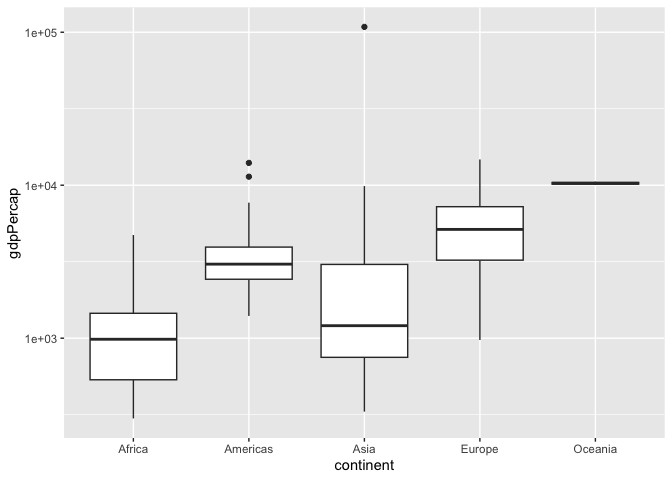
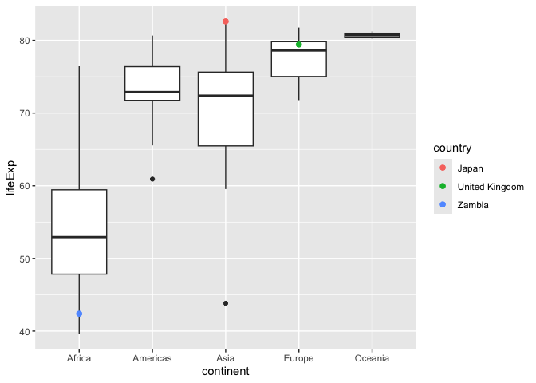
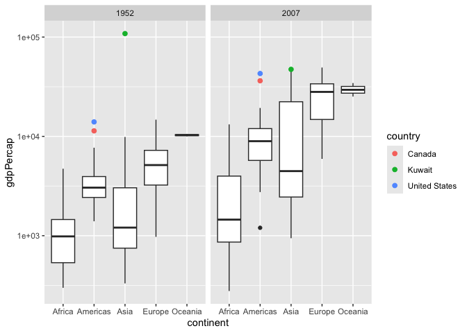
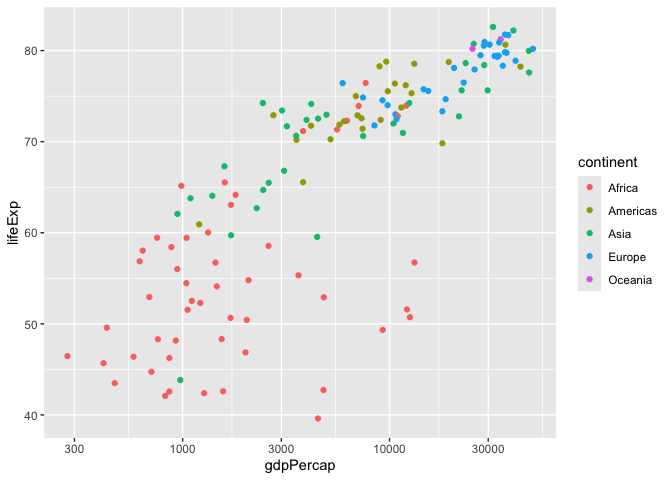
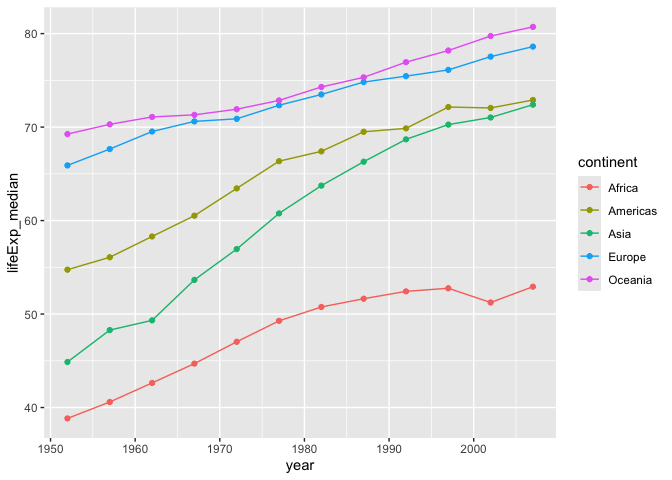
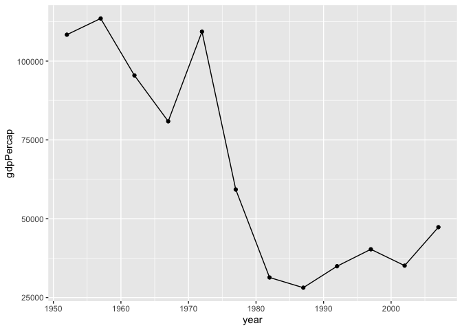

Gapminder
================
Hong Zhang
2026-10-01

- [Grading Rubric](#grading-rubric)
  - [Individual](#individual)
  - [Submission](#submission)
- [Guided EDA](#guided-eda)
  - [**q0** Perform your “first checks” on the dataset. What variables
    are in
    this](#q0-perform-your-first-checks-on-the-dataset-what-variables-are-in-this)
  - [**q1** Determine the most and least recent years in the `gapminder`
    dataset.](#q1-determine-the-most-and-least-recent-years-in-the-gapminder-dataset)
  - [**q2** Filter on years matching `year_min`, and make a plot of the
    GDP per capita against continent. Choose an appropriate `geom_` to
    visualize the data. What observations can you
    make?](#q2-filter-on-years-matching-year_min-and-make-a-plot-of-the-gdp-per-capita-against-continent-choose-an-appropriate-geom_-to-visualize-the-data-what-observations-can-you-make)
  - [**q3** You should have found *at least* three outliers in q2 (but
    possibly many more!). Identify those outliers (figure out which
    countries they
    are).](#q3-you-should-have-found-at-least-three-outliers-in-q2-but-possibly-many-more-identify-those-outliers-figure-out-which-countries-they-are)
  - [**q4** Create a plot similar to yours from q2 studying both
    `year_min` and `year_max`. Find a way to highlight the outliers from
    q3 on your plot *in a way that lets you identify which country is
    which*. Compare the patterns between `year_min` and
    `year_max`.](#q4-create-a-plot-similar-to-yours-from-q2-studying-both-year_min-and-year_max-find-a-way-to-highlight-the-outliers-from-q3-on-your-plot-in-a-way-that-lets-you-identify-which-country-is-which-compare-the-patterns-between-year_min-and-year_max)
- [Your Own EDA](#your-own-eda)
  - [**q5** Create *at least* three new figures below. With each figure,
    try to pose new questions about the
    data.](#q5-create-at-least-three-new-figures-below-with-each-figure-try-to-pose-new-questions-about-the-data)

*Purpose*: Learning to do EDA well takes practice! In this challenge
you’ll further practice EDA by first completing a guided exploration,
then by conducting your own investigation. This challenge will also give
you a chance to use the wide variety of visual tools we’ve been
learning.

<!-- include-rubric -->

# Grading Rubric

<!-- -------------------------------------------------- -->

Unlike exercises, **challenges will be graded**. The following rubrics
define how you will be graded, both on an individual and team basis.

## Individual

<!-- ------------------------- -->

| Category | Needs Improvement | Satisfactory |
|----|----|----|
| Effort | Some task **q**’s left unattempted | All task **q**’s attempted |
| Observed | Did not document observations, or observations incorrect | Documented correct observations based on analysis |
| Supported | Some observations not clearly supported by analysis | All observations clearly supported by analysis (table, graph, etc.) |
| Assessed | Observations include claims not supported by the data, or reflect a level of certainty not warranted by the data | Observations are appropriately qualified by the quality & relevance of the data and (in)conclusiveness of the support |
| Specified | Uses the phrase “more data are necessary” without clarification | Any statement that “more data are necessary” specifies which *specific* data are needed to answer what *specific* question |
| Code Styled | Violations of the [style guide](https://style.tidyverse.org/) hinder readability | Code sufficiently close to the [style guide](https://style.tidyverse.org/) |

## Submission

<!-- ------------------------- -->

Make sure to commit both the challenge report (`report.md` file) and
supporting files (`report_files/` folder) when you are done! Then submit
a link to Canvas. **Your Challenge submission is not complete without
all files uploaded to GitHub.**

``` r
library(tidyverse)
```

    ## ── Attaching core tidyverse packages ──────────────────────── tidyverse 2.0.0 ──
    ## ✔ dplyr     1.2.1     ✔ readr     2.2.0
    ## ✔ forcats   1.0.1     ✔ stringr   1.6.0
    ## ✔ ggplot2   4.0.3     ✔ tibble    3.3.1
    ## ✔ lubridate 1.9.5     ✔ tidyr     1.3.2
    ## ✔ purrr     1.2.2     
    ## ── Conflicts ────────────────────────────────────────── tidyverse_conflicts() ──
    ## ✖ dplyr::filter() masks stats::filter()
    ## ✖ dplyr::lag()    masks stats::lag()
    ## ℹ Use the conflicted package (<http://conflicted.r-lib.org/>) to force all conflicts to become errors

``` r
library(gapminder)
```

*Background*: [Gapminder](https://www.gapminder.org/about-gapminder/) is
an independent organization that seeks to educate people about the state
of the world. They seek to counteract the worldview constructed by a
hype-driven media cycle, and promote a “fact-based worldview” by
focusing on data. The dataset we’ll study in this challenge is from
Gapminder.

# Guided EDA

<!-- -------------------------------------------------- -->

First, we’ll go through a round of *guided EDA*. Try to pay attention to
the high-level process we’re going through—after this guided round
you’ll be responsible for doing another cycle of EDA on your own!

### **q0** Perform your “first checks” on the dataset. What variables are in this

dataset?

``` r
## TASK: Do your "first checks" here!
gapminder %>%
  glimpse()
```

    ## Rows: 1,704
    ## Columns: 6
    ## $ country   <fct> "Afghanistan", "Afghanistan", "Afghanistan", "Afghanistan", …
    ## $ continent <fct> Asia, Asia, Asia, Asia, Asia, Asia, Asia, Asia, Asia, Asia, …
    ## $ year      <int> 1952, 1957, 1962, 1967, 1972, 1977, 1982, 1987, 1992, 1997, …
    ## $ lifeExp   <dbl> 28.801, 30.332, 31.997, 34.020, 36.088, 38.438, 39.854, 40.8…
    ## $ pop       <int> 8425333, 9240934, 10267083, 11537966, 13079460, 14880372, 12…
    ## $ gdpPercap <dbl> 779.4453, 820.8530, 853.1007, 836.1971, 739.9811, 786.1134, …

``` r
gapminder %>%
  summary()
```

    ##         country        continent        year         lifeExp     
    ##  Afghanistan:  12   Africa  :624   Min.   :1952   Min.   :23.60  
    ##  Albania    :  12   Americas:300   1st Qu.:1966   1st Qu.:48.20  
    ##  Algeria    :  12   Asia    :396   Median :1980   Median :60.71  
    ##  Angola     :  12   Europe  :360   Mean   :1980   Mean   :59.47  
    ##  Argentina  :  12   Oceania : 24   3rd Qu.:1993   3rd Qu.:70.85  
    ##  Australia  :  12                  Max.   :2007   Max.   :82.60  
    ##  (Other)    :1632                                                
    ##       pop              gdpPercap       
    ##  Min.   :6.001e+04   Min.   :   241.2  
    ##  1st Qu.:2.794e+06   1st Qu.:  1202.1  
    ##  Median :7.024e+06   Median :  3531.8  
    ##  Mean   :2.960e+07   Mean   :  7215.3  
    ##  3rd Qu.:1.959e+07   3rd Qu.:  9325.5  
    ##  Max.   :1.319e+09   Max.   :113523.1  
    ## 

**Observations**:

- The dataset has 1704 rows and 6 variables. Each row is one country in
  one year.
  - country: the name of the country
  - continent: the continent the country is in
  - year: the year of the record, from 1952 to 2007 in steps of 5 years
  - lifeExp: life expectancy
  - pop: population
  - gdpPercap: GDP per capita

### **q1** Determine the most and least recent years in the `gapminder` dataset.

*Hint*: Use the `pull()` function to get a vector out of a tibble.
(Rather than the `$` notation of base R.)

``` r
year_max <-
  gapminder %>%
  pull(year) %>%
  max()

year_min <-
  gapminder %>%
  pull(year) %>%
  min()

year_max
```

    ## [1] 2007

``` r
year_min
```

    ## [1] 1952

Use the following test to check your work.

``` r
## NOTE: No need to change this
assertthat::assert_that(year_max %% 7 == 5)
```

    ## [1] TRUE

``` r
assertthat::assert_that(year_max %% 3 == 0)
```

    ## [1] TRUE

``` r
assertthat::assert_that(year_min %% 7 == 6)
```

    ## [1] TRUE

``` r
assertthat::assert_that(year_min %% 3 == 2)
```

    ## [1] TRUE

``` r
if (is_tibble(year_max)) {
  print("year_max is a tibble; try using `pull()` to get a vector")
  assertthat::assert_that(False)
}

print("Nice!")
```

    ## [1] "Nice!"

### **q2** Filter on years matching `year_min`, and make a plot of the GDP per capita against continent. Choose an appropriate `geom_` to visualize the data. What observations can you make?

You may encounter difficulties in visualizing these data; if so document
your challenges and attempt to produce the most informative visual you
can.

``` r
gapminder %>%
  filter(year == year_min) %>%
  ggplot(aes(continent, gdpPercap)) +
  geom_boxplot() +
  scale_y_log10()
```

<!-- -->

**Observations**:

- In 1952, Europe has the highest median GDP per capita of the
  continents with many countries and Africa has the lowest. The Americas
  and Asia are in between.

- Oceania’s box is almost a flat line because it has only 2 countries
  (24 rows in the q0 summary, spread over 12 years) so it cannot be
  compared fairly with the other continents.

- Asia has one outlier far above every other country, above 1e+05
  (100000). The Americas has two outliers above its upper whisker.

**Difficulties & Approaches**:

- With a regular y axis, the Asian outlier above 100000 was so far above
  every other country that all five boxes were squashed near the bottom
  of the plot, which made the continents hard to compare.

- I fixed this by putting the y axis on a log scale with
  scale_y_log10(). Each labeled gridline is 10 times the one below it so
  every box has room to show its shape.

### **q3** You should have found *at least* three outliers in q2 (but possibly many more!). Identify those outliers (figure out which countries they are).

``` r
gapminder %>%
  filter(year == year_min) %>%
  arrange(desc(gdpPercap)) %>%
  select(country, continent, gdpPercap) %>%
  head(5)
```

    ## # A tibble: 5 × 3
    ##   country       continent gdpPercap
    ##   <fct>         <fct>         <dbl>
    ## 1 Kuwait        Asia        108382.
    ## 2 Switzerland   Europe       14734.
    ## 3 United States Americas     13990.
    ## 4 Canada        Americas     11367.
    ## 5 New Zealand   Oceania      10557.

**Observations**:

- Identify the outlier countries from q2
  - The three outliers on the log scale plot are Kuwait, the United
    States, and Canada. Kuwait is the single point far above Asia, with
    a GDP per capita of about 108000, more than 7 times the next highest
    country in the table. The United States (about 14000) and Canada
    (about 11400) are the two points above the Americas whisker.

  - Switzerland and New Zealand are also in the top five but are not
    outliers because Europe and Oceania have higher boxes. Switzerland
    has a higher GDP per capita than the United States but is not an
    outlier. Whether a country is an outlier depends on how it compares
    to its own continent and not just on its value.

*Hint*: For the next task, it’s helpful to know a ggplot trick we’ll
learn in an upcoming exercise: You can use the `data` argument inside
any `geom_*` to modify the data that will be plotted *by that geom
only*. For instance, you can use this trick to filter a set of points to
label:

``` r
## NOTE: No need to edit, use ideas from this in q4 below
gapminder %>%
  filter(year == max(year)) %>%

  ggplot(aes(continent, lifeExp)) +
  geom_boxplot() +
  geom_point(
    data = . %>% filter(country %in% c("United Kingdom", "Japan", "Zambia")),
    mapping = aes(color = country),
    size = 2
  )
```

<!-- -->

### **q4** Create a plot similar to yours from q2 studying both `year_min` and `year_max`. Find a way to highlight the outliers from q3 on your plot *in a way that lets you identify which country is which*. Compare the patterns between `year_min` and `year_max`.

*Hint*: We’ve learned a lot of different ways to show multiple
variables; think about using different aesthetics or facets.

``` r
## TASK: Create a visual of gdpPercap vs continent
gapminder %>%
  filter(year %in% c(year_min, year_max)) %>%
  ggplot(aes(continent, gdpPercap)) +
  geom_boxplot() +
  geom_point(
    data = . %>% filter(country %in% c("Kuwait", "United States", "Canada")),
    mapping = aes(color = country),
    size = 2
  ) +
  scale_y_log10() +
  facet_wrap(~ year)
```

<!-- -->

**Observations**:

- Every continent’s box is higher in 2007 than it is in 1952 so the
  typical GDP per capita rose on every continent. Europe’s median moved
  up the most and Africa’s moved up the least so the gap between Europe
  and Africa got wider.

- Kuwait is the only one of the three highlighted countries that moved
  down. In 1952, it is far above the rest of Asia, above 1e+05. In 2007
  it is below 1e+05 and sits at the top of Asia’s upper whisker, so it
  is no longer an outlier.

- The United States and Canada are outliers above the Americas whisker
  in both years, and both moved up from 1952 to 2007.

- Asia’s box is much taller in 2007 than in 1952 so Asian countries
  became more spread out. In 2007, the top of Asia’s box reaches into
  the range of Europe’s box.

- In 2007, a new low outlier appears below the Americas box, which was
  not there in 1952.

# Your Own EDA

<!-- -------------------------------------------------- -->

Now it’s your turn! We just went through guided EDA considering the GDP
per capita at two time points. You can continue looking at outliers,
consider different years, repeat the exercise with `lifeExp`, consider
the relationship between variables, or something else entirely.

### **q5** Create *at least* three new figures below. With each figure, try to pose new questions about the data.

``` r
gapminder %>%
  filter(year == year_max) %>%
  ggplot(aes(gdpPercap, lifeExp, color = continent)) +
  geom_point() +
  scale_x_log10()
```

<!-- -->

``` r
# filters for countries with high GDP per capita but low life expectancy
gapminder %>%
  filter(year == year_max, gdpPercap > 7000, lifeExp < 60) %>%
  select(country, continent, gdpPercap, lifeExp)
```

    ## # A tibble: 4 × 4
    ##   country           continent gdpPercap lifeExp
    ##   <fct>             <fct>         <dbl>   <dbl>
    ## 1 Botswana          Africa       12570.    50.7
    ## 2 Equatorial Guinea Africa       12154.    51.6
    ## 3 Gabon             Africa       13206.    56.7
    ## 4 South Africa      Africa        9270.    49.3

- Question: In 2007, do countries with higher GDP per capita have longer
  life expectancy?
- Yes, there is a clear pattern. The points rise from the lower left to
  the upper right so countries with higher GDP per capita tend to have
  higher life expectancy. Every European country has a life expectancy
  above 70 while most African countries are in the bottom left.
- There are exceptions. Four African countries, Botswana, Equatorial
  Guinea, Gabon, and South Africa, have GDP per capita above 7000 but
  life expectancy below 60. They are the red points in the lower right,
  well below other countries with similar GDP per capita.
- This shows that GDP per capita and life expectancy go together but it
  does not show that one causes the other. It also raises a new question
  about why those four countries have lower life expectancy than their
  GDP per capita would suggest. Answering that would require data on
  causes of death in those countries, such as disease rates.

``` r
gapminder %>%
  group_by(continent, year) %>%
  summarize(lifeExp_median = median(lifeExp)) %>%
  ggplot(aes(year, lifeExp_median, color = continent)) +
  geom_line() +
  geom_point()
```

    ## `summarise()` has regrouped the output.
    ## ℹ Summaries were computed grouped by continent and year.
    ## ℹ Output is grouped by continent.
    ## ℹ Use `summarise(.groups = "drop_last")` to silence this message.
    ## ℹ Use `summarise(.by = c(continent, year))` for per-operation grouping
    ##   (`?dplyr::dplyr_by`) instead.

<!-- -->

- Question: Has the gap in life expectancy between continents closed
  from 1952 to 2007?
- Median life expectancy went up on every continent between 1952 and
  2007.
- Asia closed the most ground. Its median rose from about 45 to about
  72, nearly catching the Americas at about 73.
- Africa did not close the gap. Its median rose from about 39 to about
  53, but Europe’s rose from about 66 to about 79, so the gap between
  them only went from about 27 years to about 26 years. Africa’s line
  also flattens after the late 1980s and drops between 1997 and 2002,
  the only noticeable drop on the plot.
- These are medians, so they hide how spread out countries are within
  each continent, and Oceania has only 2 countries. This raises a new
  question about why Africa’s life expectancy nearly stopped rising
  after the late 1980s. Answering it would require data on causes of
  death in African countries over time.

``` r
gapminder %>%
  filter(country == "Kuwait") %>%
  ggplot(aes(year, gdpPercap)) +
  geom_line() +
  geom_point()
```

<!-- -->

- Question: How did Kuwait’s GDP per capita change from 1952 to 2007,
  and when did it drop?
- From 1952 to 1972, Kuwait’s GDP per capita stayed above 75000.
- After 1972 it fell sharply, down to about 30000 by the early 1980s.
- After its lowest point in 1987, about 28000, it mostly rose again,
  with one dip in 2002. In 2007 it was below 50000, still less than half
  of its 1952 value, which was above 100000.
- This plot shows when the drop happened but not why. Answering that
  would require data on what makes up Kuwait’s economy each year, such
  as how much of its GDP comes from oil exports.
