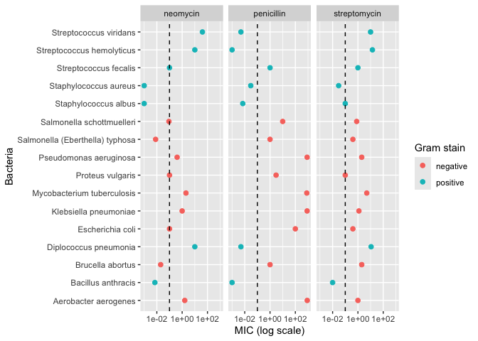
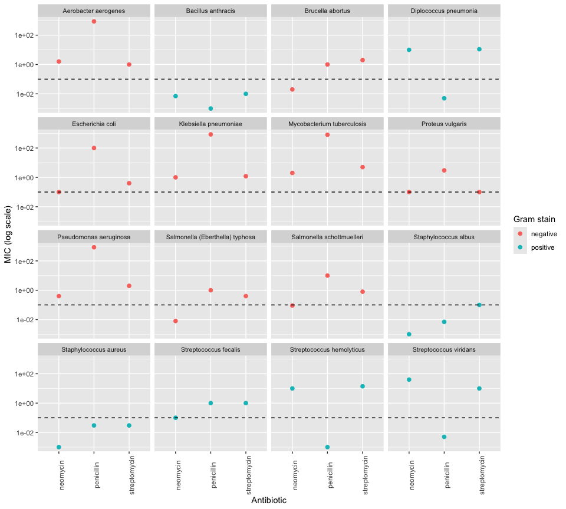
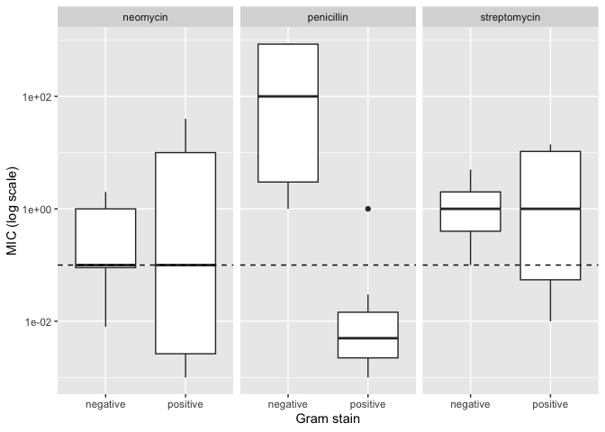
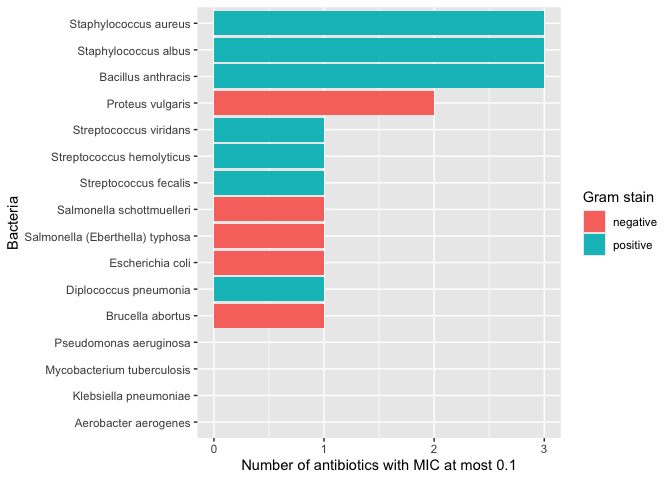
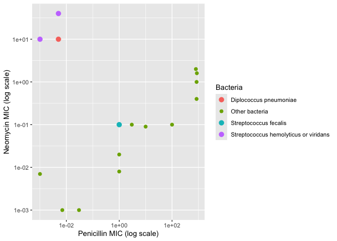

Antibiotics
================
Hong Zhang
2026-10-07

*Purpose*: Creating effective data visualizations is an *iterative*
process; very rarely will the first graph you make be the most
effective. The most effective thing you can do to be successful in this
iterative process is to *try multiple graphs* of the same data.

Furthermore, judging the effectiveness of a visual is completely
dependent on *the question you are trying to answer*. A visual that is
totally ineffective for one question may be perfect for answering a
different question.

In this challenge, you will practice *iterating* on data visualization,
and will anchor the *assessment* of your visuals using two different
questions.

*Note*: Please complete your initial visual design **alone**. Work on
both of your graphs alone, and save a version to your repo *before*
coming together with your team. This way you can all bring a diversity
of ideas to the table!

<!-- include-rubric -->

# Grading Rubric

<!-- -------------------------------------------------- -->

Unlike exercises, **challenges will be graded**. The following rubrics
define how you will be graded, both on an individual and team basis.

## Individual

<!-- ------------------------- -->

| Category | Needs Improvement | Satisfactory |
|----|----|----|
| Effort | Some task **q**’s left unattempted | All task **q**’s attempted |
| Observed | Did not document observations, or observations incorrect | Documented correct observations based on analysis |
| Supported | Some observations not clearly supported by analysis | All observations clearly supported by analysis (table, graph, etc.) |
| Assessed | Observations include claims not supported by the data, or reflect a level of certainty not warranted by the data | Observations are appropriately qualified by the quality & relevance of the data and (in)conclusiveness of the support |
| Specified | Uses the phrase “more data are necessary” without clarification | Any statement that “more data are necessary” specifies which *specific* data are needed to answer what *specific* question |
| Code Styled | Violations of the [style guide](https://style.tidyverse.org/) hinder readability | Code sufficiently close to the [style guide](https://style.tidyverse.org/) |

## Submission

<!-- ------------------------- -->

Make sure to commit both the challenge report (`report.md` file) and
supporting files (`report_files/` folder) when you are done! Then submit
a link to Canvas. **Your Challenge submission is not complete without
all files uploaded to GitHub.**

``` r
library(tidyverse)
```

    ## ── Attaching core tidyverse packages ──────────────────────── tidyverse 2.0.0 ──
    ## ✔ dplyr     1.2.1     ✔ readr     2.2.0
    ## ✔ forcats   1.0.1     ✔ stringr   1.6.0
    ## ✔ ggplot2   4.0.3     ✔ tibble    3.3.1
    ## ✔ lubridate 1.9.5     ✔ tidyr     1.3.2
    ## ✔ purrr     1.2.2     
    ## ── Conflicts ────────────────────────────────────────── tidyverse_conflicts() ──
    ## ✖ dplyr::filter() masks stats::filter()
    ## ✖ dplyr::lag()    masks stats::lag()
    ## ℹ Use the conflicted package (<http://conflicted.r-lib.org/>) to force all conflicts to become errors

``` r
library(ggrepel)
```

*Background*: The data\[1\] we study in this challenge report the
[*minimum inhibitory
concentration*](https://en.wikipedia.org/wiki/Minimum_inhibitory_concentration)
(MIC) of three drugs for different bacteria. The smaller the MIC for a
given drug and bacteria pair, the more practical the drug is for
treating that particular bacteria. An MIC value of *at most* 0.1 is
considered necessary for treating human patients.

These data report MIC values for three antibiotics—penicillin,
streptomycin, and neomycin—on 16 bacteria. Bacteria are categorized into
a genus based on a number of features, including their resistance to
antibiotics.

``` r
## NOTE: If you extracted all challenges to the same location,
## you shouldn't have to change this filename
filename <- "./data/antibiotics.csv"

## Load the data
df_antibiotics <- read_csv(filename)
```

    ## Rows: 16 Columns: 5
    ## ── Column specification ────────────────────────────────────────────────────────
    ## Delimiter: ","
    ## chr (2): bacteria, gram
    ## dbl (3): penicillin, streptomycin, neomycin
    ## 
    ## ℹ Use `spec()` to retrieve the full column specification for this data.
    ## ℹ Specify the column types or set `show_col_types = FALSE` to quiet this message.

``` r
df_antibiotics %>% knitr::kable()
```

| bacteria                        | penicillin | streptomycin | neomycin | gram     |
|:--------------------------------|-----------:|-------------:|---------:|:---------|
| Aerobacter aerogenes            |    870.000 |         1.00 |    1.600 | negative |
| Brucella abortus                |      1.000 |         2.00 |    0.020 | negative |
| Bacillus anthracis              |      0.001 |         0.01 |    0.007 | positive |
| Diplococcus pneumonia           |      0.005 |        11.00 |   10.000 | positive |
| Escherichia coli                |    100.000 |         0.40 |    0.100 | negative |
| Klebsiella pneumoniae           |    850.000 |         1.20 |    1.000 | negative |
| Mycobacterium tuberculosis      |    800.000 |         5.00 |    2.000 | negative |
| Proteus vulgaris                |      3.000 |         0.10 |    0.100 | negative |
| Pseudomonas aeruginosa          |    850.000 |         2.00 |    0.400 | negative |
| Salmonella (Eberthella) typhosa |      1.000 |         0.40 |    0.008 | negative |
| Salmonella schottmuelleri       |     10.000 |         0.80 |    0.090 | negative |
| Staphylococcus albus            |      0.007 |         0.10 |    0.001 | positive |
| Staphylococcus aureus           |      0.030 |         0.03 |    0.001 | positive |
| Streptococcus fecalis           |      1.000 |         1.00 |    0.100 | positive |
| Streptococcus hemolyticus       |      0.001 |        14.00 |   10.000 | positive |
| Streptococcus viridans          |      0.005 |        10.00 |   40.000 | positive |

# Visualization

<!-- -------------------------------------------------- -->

### **q1** Prototype 5 visuals

To start, construct **5 qualitatively different visualizations of the
data** `df_antibiotics`. These **cannot** be simple variations on the
same graph; for instance, if two of your visuals could be made identical
by calling `coord_flip()`, then these are *not* qualitatively different.

For all five of the visuals, you must show information on *all 16
bacteria*. For the first two visuals, you must *show all variables*.

*Hint 1*: Try working quickly on this part; come up with a bunch of
ideas, and don’t fixate on any one idea for too long. You will have a
chance to refine later in this challenge.

*Hint 2*: The data `df_antibiotics` are in a *wide* format; it may be
helpful to `pivot_longer()` the data to make certain visuals easier to
construct.

#### Visual 1 (All variables)

In this visual you must show *all three* effectiveness values for *all
16 bacteria*. This means **it must be possible to identify each of the
16 bacteria by name.** You must also show whether or not each bacterium
is Gram positive or negative.

``` r
# long format with one row per bacteria and antibiotic
df_long <-
  df_antibiotics %>%
  pivot_longer(
    names_to = "antibiotic",
    values_to = "mic",
    cols = c(penicillin, streptomycin, neomycin)
  )

# dashed line marks the 0.1 mic cutoff for treating patients
df_long %>%
  ggplot(aes(mic, bacteria, color = gram)) +
  geom_point(size = 2) +
  geom_vline(xintercept = 0.1, linetype = "dashed") +
  scale_x_log10() +
  facet_wrap(~antibiotic) +
  labs(
    x = "MIC (log scale)",
    y = "Bacteria",
    color = "Gram stain"
  )
```

<!-- -->

#### Visual 2 (All variables)

In this visual you must show *all three* effectiveness values for *all
16 bacteria*. This means **it must be possible to identify each of the
16 bacteria by name.** You must also show whether or not each bacterium
is Gram positive or negative.

Note that your visual must be *qualitatively different* from *all* of
your other visuals.

``` r
df_long %>%
  ggplot(aes(antibiotic, mic, color = gram)) +
  geom_point(size = 2) +
  geom_hline(yintercept = 0.1, linetype = "dashed") +
  scale_y_log10() +
  facet_wrap(~bacteria, ncol = 4) +
  theme(
    axis.text.x = element_text(angle = 90),
    strip.text = element_text(size = 8)
  ) +
  labs(
    x = "Antibiotic",
    y = "MIC (log scale)",
    color = "Gram stain"
  )
```

<!-- -->

#### Visual 3 (Some variables)

In this visual you may show a *subset* of the variables (`penicillin`,
`streptomycin`, `neomycin`, `gram`), but you must still show *all 16
bacteria*.

Note that your visual must be *qualitatively different* from *all* of
your other visuals.

``` r
df_long %>%
  ggplot(aes(gram, mic)) +
  geom_boxplot() +
  geom_hline(yintercept = 0.1, linetype = "dashed") +
  scale_y_log10() +
  facet_wrap(~antibiotic) +
  labs(
    x = "Gram stain",
    y = "MIC (log scale)"
  )
```

<!-- -->

#### Visual 4 (Some variables)

In this visual you may show a *subset* of the variables (`penicillin`,
`streptomycin`, `neomycin`, `gram`), but you must still show *all 16
bacteria*.

Note that your visual must be *qualitatively different* from *all* of
your other visuals.

``` r
# count how many of the three antibiotics reach the 0.1 cutoff
df_long %>%
  group_by(bacteria, gram) %>%
  summarize(n_effective = sum(mic <= 0.1)) %>%
  ungroup() %>%
  mutate(bacteria = fct_reorder(bacteria, n_effective)) %>%
  ggplot(aes(bacteria, n_effective, fill = gram)) +
  geom_col() +
  coord_flip() +
  labs(
    x = "Bacteria",
    y = "Number of antibiotics with MIC at most 0.1",
    fill = "Gram stain"
  )
```

<!-- -->

#### Visual 5 (Some variables)

In this visual you may show a *subset* of the variables (`penicillin`,
`streptomycin`, `neomycin`, `gram`), but you must still show *all 16
bacteria*.

Note that your visual must be *qualitatively different* from *all* of
your other visuals.

``` r
df_antibiotics %>%
  ggplot(aes(penicillin, neomycin)) +
  geom_point(aes(color = "Other bacteria"), size = 2) +
  # give diplococcus and the streptococcus bacteria their own colors
  geom_point(
    data = . %>% filter(bacteria == "Diplococcus pneumonia"),
    mapping = aes(color = "Diplococcus pneumoniae"),
    size = 3
  ) +
  geom_point(
    data = . %>%
      filter(
        bacteria %in% c("Streptococcus hemolyticus", "Streptococcus viridans")
      ),
    mapping = aes(color = "Streptococcus hemolyticus or viridans"),
    size = 3
  ) +
  geom_point(
    data = . %>% filter(bacteria == "Streptococcus fecalis"),
    mapping = aes(color = "Streptococcus fecalis"),
    size = 3
  ) +
  scale_x_log10() +
  scale_y_log10() +
  labs(
    x = "Penicillin MIC (log scale)",
    y = "Neomycin MIC (log scale)",
    color = "Bacteria"
  )
```

<!-- -->

### **q2** Assess your visuals

There are **two questions** below; use your five visuals to help answer
both Guiding Questions. Note that you must also identify which of your
five visuals were most helpful in answering the questions.

*Hint 1*: It’s possible that *none* of your visuals is effective in
answering the questions below. You may need to revise one or more of
your visuals to answer the questions below!

*Hint 2*: It’s **highly unlikely** that the same visual is the most
effective at helping answer both guiding questions. **Use this as an
opportunity to think about why this is.**

#### Guiding Question 1

> How do the three antibiotics vary in their effectiveness against
> bacteria of different genera and Gram stain?

*Observations*

- What is your response to the question above?
  - Penicillin’s effectiveness depends on Gram stain. In Visual 1, 6 of
    the 7 Gram positive bacteria are at or left of the dashed 0.1 line
    for penicillin. The only exception is Streptococcus fecalis at 1.
    None of the 9 Gram negative bacteria reach the line and the data
    table printed in the load chunk shows their penicillin MICs range
    from 1 to 870. Visual 3 shows the same split. The Gram negative
    penicillin box is entirely above the dashed line and the Gram
    positive box is below it.
  - Streptomycin reaches the cutoff for the fewest bacteria. Only four
    bacteria reach the 0.1 line in Visual 1. They are Bacillus
    anthracis, Staphylococcus albus, Staphylococcus aureus and Proteus
    vulgaris. Proteus vulgaris is the only Gram negative one.
  - Neomycin reaches the cutoff for the most bacteria. In the neomycin
    panel of Visual 1, 9 of the 16 bacteria are at or left of the dashed
    line, compared with 6 for penicillin and 4 for streptomycin.
    Neomycin is also the only antibiotic that works on many Gram
    negative bacteria. Five red points are at or left of the line in the
    neomycin panel, compared with one for streptomycin and none for
    penicillin. These are Brucella abortus, Escherichia coli, Proteus
    vulgaris and both Salmonella bacteria. Neomycin does not work on
    Streptococcus hemolyticus, Streptococcus viridans or Diplococcus
    pneumoniae. In Visual 1, these three are far right of the line and
    the data table shows their neomycin MICs are 10 or more.
  - Looking at genera in Visual 1, both Staphylococcus bacteria are at
    or left of the line for all three antibiotics. Both Salmonella
    bacteria are left of the line only for neomycin. The Streptococcus
    genus is mixed. Streptococcus hemolyticus and viridans respond only
    to penicillin while Streptococcus fecalis responds only to neomycin.
  - Four Gram negative bacteria are right of the line for every
    antibiotic. They are Aerobacter aerogenes, Klebsiella pneumoniae,
    Mycobacterium tuberculosis and Pseudomonas aeruginosa. They are also
    the four bacteria with no bar in Visual 4. None of these three
    antibiotics would be practical for treating them.
  - Some of these results are close calls. In Visual 1, Escherichia coli
    and Streptococcus fecalis are right on the dashed line for neomycin.
    The data table shows both have a neomycin MIC of exactly 0.1 and
    they only barely count as effective. Each genus also has only one to
    three bacteria in this dataset. That is too few to know whether the
    genus patterns hold for other bacteria in the same genus.
- Which of your visuals above (1 through 5) is **most effective** at
  helping to answer this question?
  - Visual 1
- Why?
  - Visual 1 gives each antibiotic its own panel with the 0.1 cutoff
    marked. Every bacterium is listed by name on the same vertical axis
    and each point is colored by Gram stain. Reading down a panel shows
    which bacteria a drug works on and the colors show how that lines up
    with Gram stain. MIC is shown by position along a common log scale,
    which is the easiest kind of comparison to read accurately. The
    bacteria are in alphabetical order. This puts bacteria from the same
    genus next to each other and makes genus patterns easy to spot.
    Visual 3 shows the Gram stain split more compactly but it hides the
    individual bacteria. It can’t show anything about genera.

#### Guiding Question 2

In 1974 *Diplococcus pneumoniae* was renamed *Streptococcus pneumoniae*,
and in 1984 *Streptococcus fecalis* was renamed *Enterococcus fecalis*
\[2\].

> Why was *Diplococcus pneumoniae* was renamed *Streptococcus
> pneumoniae*?

*Observations*

- What is your response to the question above?
  - Diplococcus pneumoniae responds to these antibiotics almost the same
    way as Streptococcus hemolyticus and Streptococcus viridans. In
    Visual 5, those three are the only bacteria in the upper left
    corner. They all have very low penicillin MICs and high neomycin
    MICs. The data table shows penicillin MICs of 0.005 or less and
    neomycin MICs of 10 or more for all three. Visual 5 leaves out
    streptomycin but the data table shows it matches too, at 11 for
    Diplococcus pneumoniae and 14 and 10 for the two Streptococcus. The
    data table also shows all three are Gram positive.
  - The background says bacteria are grouped into a genus based on
    several features, including their resistance to antibiotics.
    Diplococcus pneumoniae has the same resistance pattern as these two
    Streptococcus. This suggests it is closely related to them and fits
    with it being renamed into the Streptococcus genus.
  - Streptococcus fecalis supports this from the other direction. In
    Visual 5, it is far from the other two Streptococcus. The data table
    shows it has a penicillin MIC of 1 and a neomycin MIC of 0.1. It was
    later moved out of Streptococcus and renamed Enterococcus fecalis in
    1984.
  - This data can’t confirm why the name changed. It only covers
    resistance to three antibiotics and a genus is based on other
    features as well. Confirming the reason would require data on those
    other features for Diplococcus pneumoniae and the Streptococcus
    species, such as how genetically similar they are.
  - With a quick Google search, I found that Wikipedia’s article on
    Streptococcus pneumoniae says it was renamed in 1974 “because it was
    very similar to streptococci.” This agrees with Visual 5, which
    shows Diplococcus pneumoniae in the same corner as the two
    Streptococcus. The article also says the name Diplococcus pneumoniae
    came from how the bacteria looked in Gram-stained sputum, which is a
    feature this dataset doesn’t include.
- Which of your visuals above (1 through 5) is **most effective** at
  helping to answer this question?
  - Visual 5
- Why?
  - Visual 5 shows each bacterium as one point on two shared log scales
    and gives Diplococcus pneumoniae and the Streptococcus bacteria
    their own colors. Bacteria that respond to penicillin and neomycin
    in similar ways end up close together. This makes the group of
    Diplococcus pneumoniae and the two Streptococcus easy to see. It
    also shows how far Streptococcus fecalis is from them. Visual 1 also
    contains these values but comparing whole profiles there means
    matching each bacterium’s three points across separate panels.
    Guiding Question 1 compares the antibiotics across groups of
    bacteria and a visual organized by antibiotic works best for that.
    Guiding Question 2 compares one bacterium’s overall pattern with the
    others and a visual that places similar bacteria next to each other
    works better for that.

# References

<!-- -------------------------------------------------- -->

\[1\] Neomycin in skin infections: A new topical antibiotic with wide
antibacterial range and rarely sensitizing. Scope. 1951;3(5):4-7.

\[2\] Wainer and Lysen, “That’s Funny…” *American Scientist* (2009)
[link](https://www.americanscientist.org/article/thats-funny)
